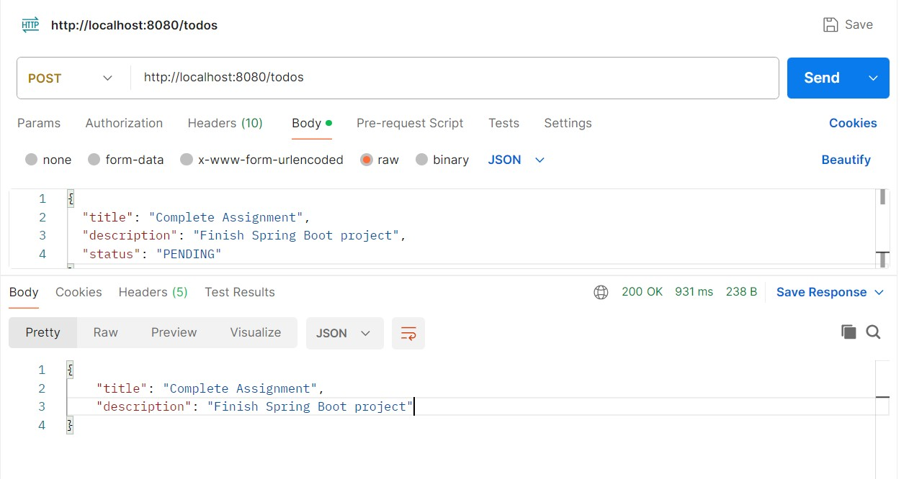
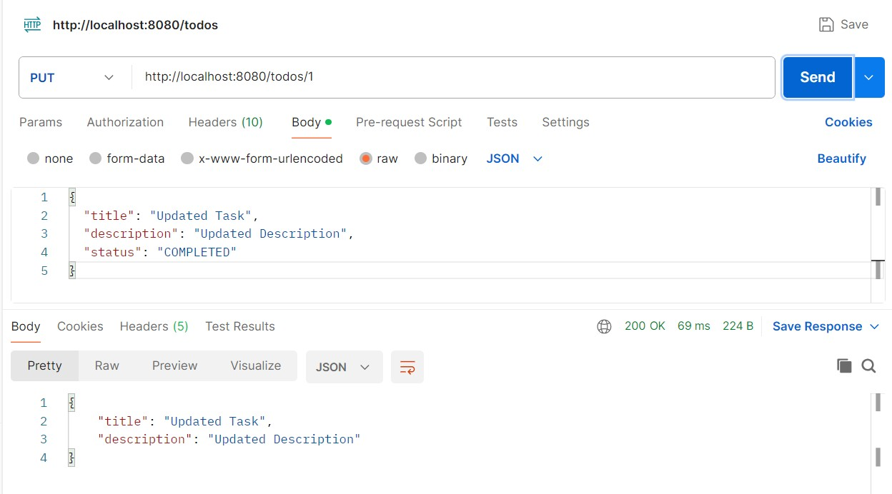
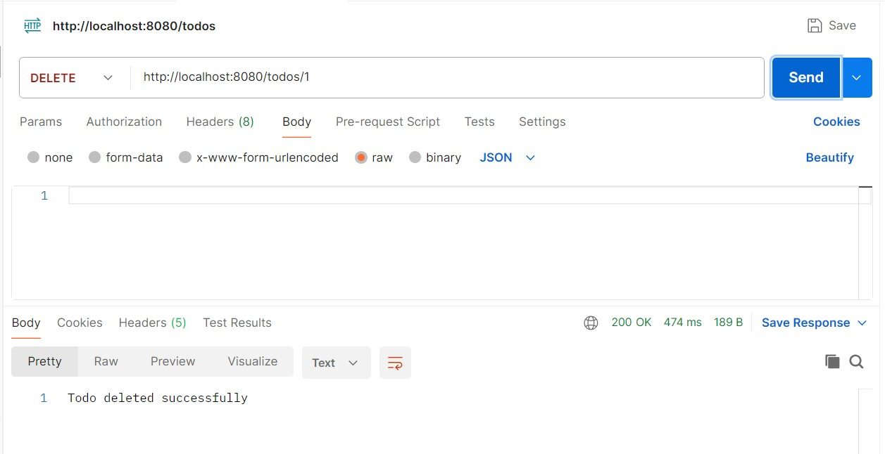
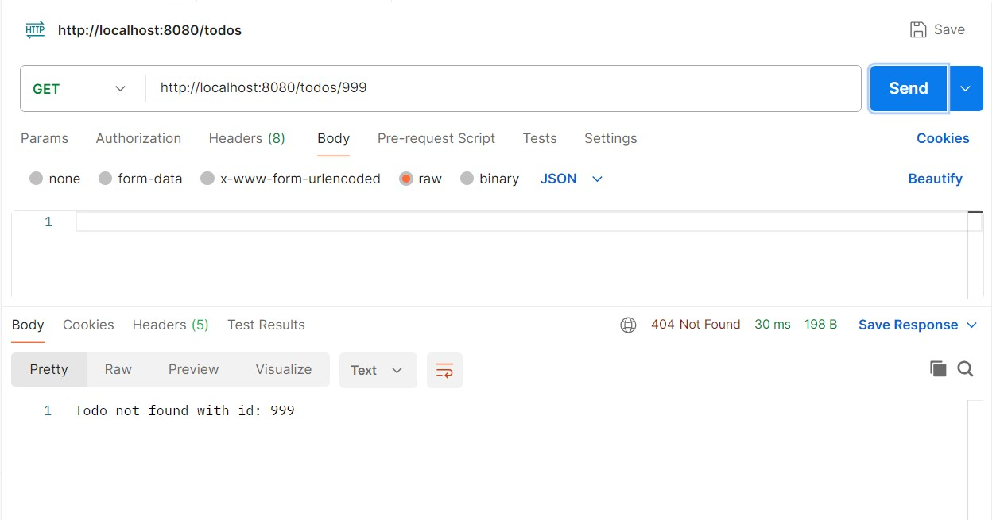
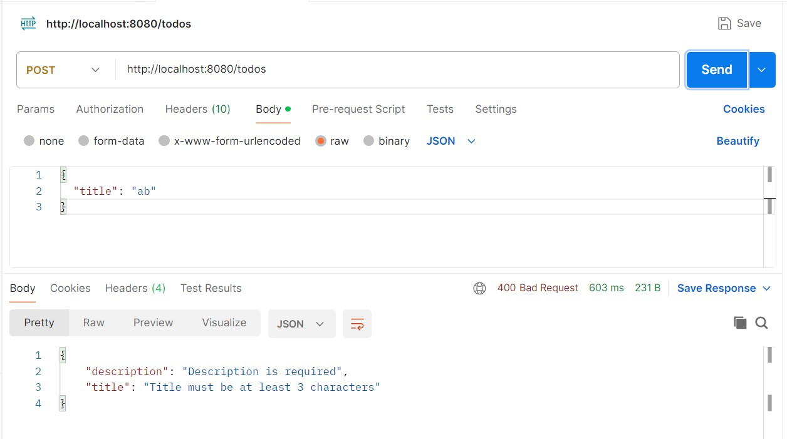
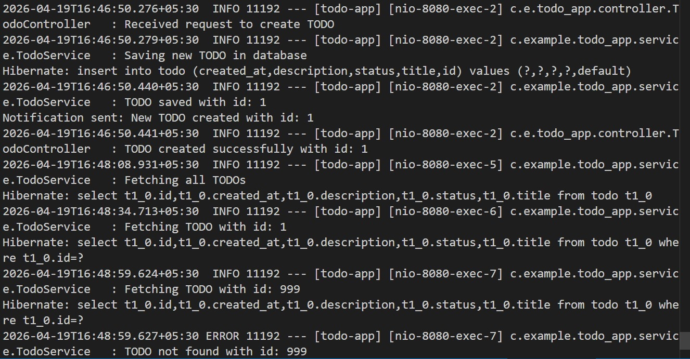
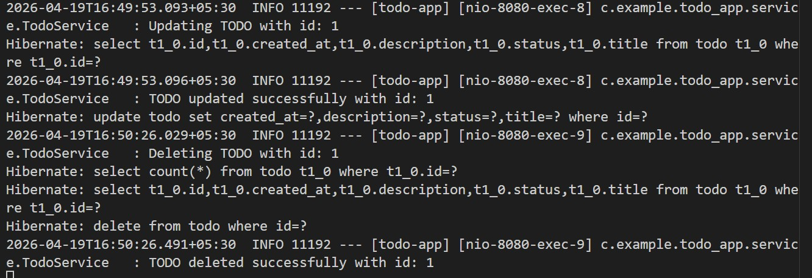

# Todo App (Spring Boot Assignment)

## About Project

This is a **Spring Boot based REST API** for managing Todo tasks.  
In this project, I implemented core backend concepts like **CRUD operations, DTO mapping, validation, exception handling, logging, NotificationService and unit testing**.

The goal of this assignment was to understand how a real backend application works using proper layered architecture.

---

## Project Architecture

The project follows a layered structure:


Client → Controller → Service → Repository → Database


- **Controller** → Handles API requests  
- **Service** → Contains business logic  
- **Repository** → Interacts with database  
- **Model** → Represents database table  

---

## Tech Stack

- Java 17  
- Spring Boot  
- Spring Data JPA (Hibernate)  
- H2 Database (In-memory)  
- Maven  
- Jakarta Validation  
- JUnit + Mockito  
- SLF4J (Logging)

---

## Project Structure


com.example.todo_app
│
├── controller
│   └── TodoController.java
│
├── service
│   ├── TodoService.java
│   └── NotificationServiceClient.java
│
├── repository
│   └── TodoRepository.java
│
├── model
│   ├── Todo.java
│   └── Status.java
│
├── dto
│   └── TodoDTO.java
│
├── mapper
│   └── TodoMapper.java
│
└── exception
    ├── ResourceNotFoundException.java
    └── GlobalExceptionHandler.java
---

## Features Implemented

- Create Todo  
- Get All Todos  
- Get Todo by ID  
- Update Todo  
- Delete Todo  

- DTO ↔ Entity Mapping  
- Input Validation using `@Valid`  
- Global Exception Handling  
- Logging using SLF4J  
- Unit Testing using JUnit & Mockito  
- Status Transition Logic (**PENDING ↔ COMPLETED**)

---

## API Endpoints

| Method | Endpoint        | Description           |
|--------|----------------|-----------------------|
| POST   | /todos         | Create a new Todo     |
| GET    | /todos         | Get all Todos         |
| GET    | /todos/{id}    | Get Todo by ID        |
| PUT    | /todos/{id}    | Update Todo           |
| DELETE | /todos/{id}    | Delete Todo           |

---

## Postman Test Cases

### 1. Create Todo
**POST /todos**
```json
{
  "title": "Complete Assignment",
  "description": "Finish Spring Boot project",
  "status": "PENDING"
}
```


### 2. Get All Todos

GET /todos


### 3. Get Todo by ID

GET /todos/1


### 4. Update Todo

PUT /todos/1

```json
{
  "title": "Updated Task",
  "description": "Updated Description",
  "status": "COMPLETED"
}
```


### 5. Delete Todo

DELETE /todos/1



### 6. Exception Case

GET /todos/999



### 7. Validation Case

POST /todos
```json
{
  "title": "ab"
}
```


### Validation Rules
title → required & minimum 3 characters
description → optional
status → PENDING or COMPLETED

### Status Transition Logic

Only allowed:

PENDING → COMPLETED
COMPLETED → PENDING

Any other transition will throw an exception.

### Exception Handling
- Custom exception: ResourceNotFoundException
- Handled globally using @RestControllerAdvice

### Unit Testing

Unit tests are implemented using:

- JUnit
- Mockito
- Covered Cases:
- Create Todo
- Get Todo by ID
- Update Todo
- Delete Todo

### Logging

Logging is added in service layer and Controller layer using SLF4J.




### How to Run
- Clone repository
git clone <your-repo-url>
- Navigate to project
cd todo-app
- Run application
mvn spring-boot:run
- Access APIs at
http://localhost:8080/todos

### Important Notes
- Uses H2 in-memory database
- Data resets on application restart
- DTO is used for clean API design

### Author

Jiyanshi Keshri