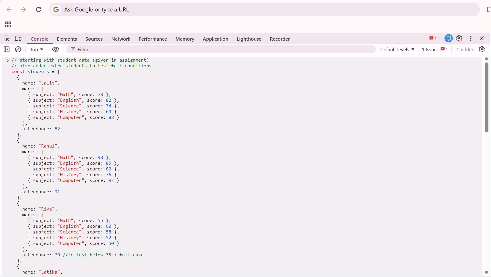
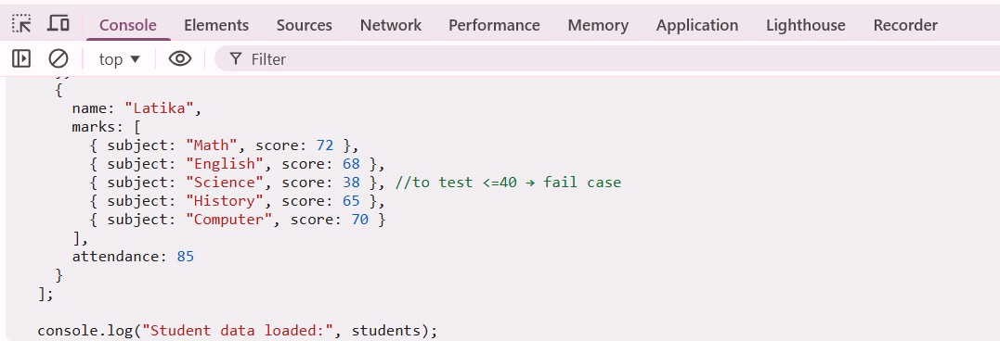
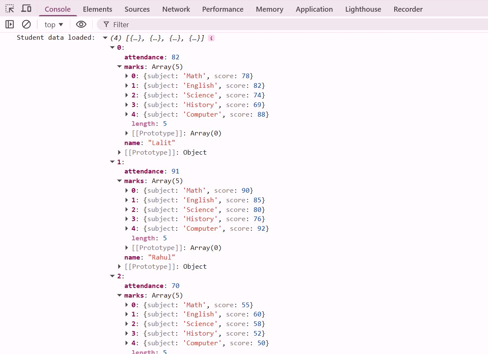
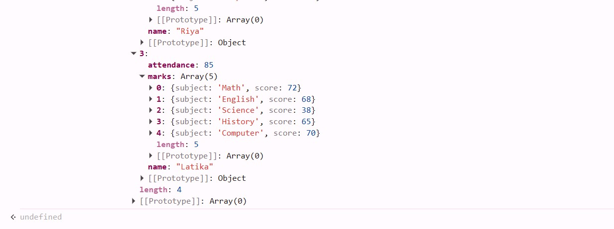
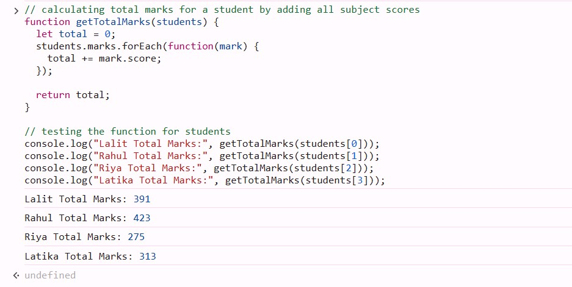
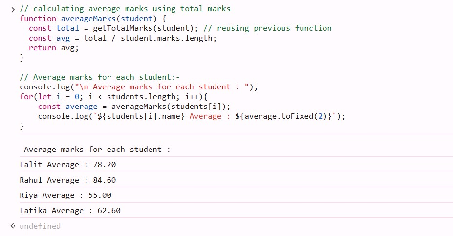
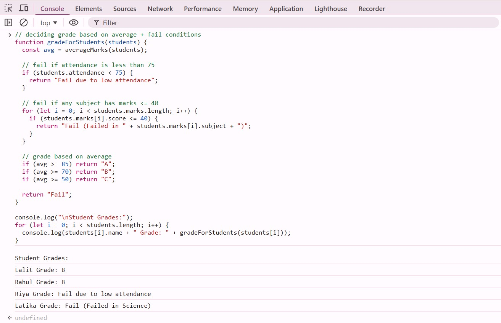
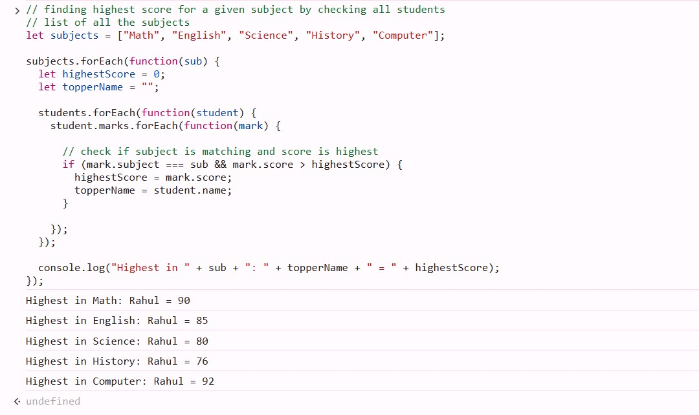
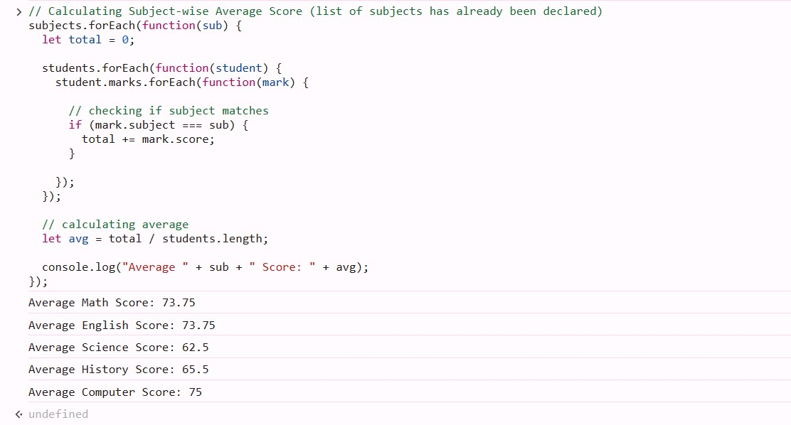
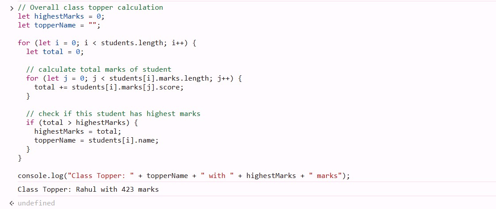

# Student Performance Analyzer - JavaScript Assignment

## Console Output Screenshots & Explanation

### Screenshot 1: Student Data

**What This Shows:**
- Created an array of student objects
- Each student has name, marks (array of subjects), and attendance
- Added extra students to test fail conditions

**Output:**

### Screenshot 2: Total Marks Calculation

**What This Demonstrates:**
- Used a function to calculate total marks
- Loop through each subject using forEach
- Added all scores to get total

**Logic Used:**
- Loop through marks array
- Add each subject score to total

**Output:**

### Screenshot 3: Average Marks Calculation

**What This Demonstrates:**
- Used total marks to calculate average
- Divided total by number of subjects
- Used toFixed() to format decimal

**Output:**

### Screenshot 4: Grade Assignment
Added grade logic before because Grade depends on Average

**What This Demonstrates:**
- Grade assigned based on average marks
- A (85+), B (70–84), C (50–69), Fail (<50)

**Fail Conditions:**
- Attendance < 75
- Any subject marks ≤ 40

**Output:**

### Screenshot 5: Subject-wise Highest Score

**What This Demonstrates:**
- Compared all students for each subject
- Found highest score and student name

**Output:**

### Screenshot 6: Subject-wise Average Score

**What This Demonstrates:**
- Calculated average marks for each subject
- Added marks of all students and divided by total students

**Output:**

### Screenshot 7: Class Topper

**What This Demonstrates:**
- Compared total marks of all students
- Found student with highest marks

**Output:**

---

## Conclusion

- Implemented all required functionalities using JavaScript
- Used loops, functions, and conditions effectively
- Handled edge cases like low attendance and failing subjects
- Program successfully runs in console and displays all outputs